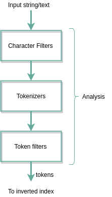

[](https://travis-ci.com/mtumilowicz/java12-elasticsearch-inverted-index-workshop)
[](https://www.gnu.org/licenses/gpl-3.0)

# java12-elasticsearch-inverted-index-workshop

* references
    * http://siddhumehta.blogspot.com/2014/06/elasticsearch-tutorial-inverted-index.html
    * https://www.manning.com/books/elasticsearch-in-action
    * https://medium.com/elasticsearch/introduction-to-analysis-and-analyzers-in-elasticsearch-4cf24d49ddab
    * https://www.elastic.co/guide/en/elasticsearch/reference/current/analysis-mapping-charfilter.html
    * https://www.elastic.co/guide/en/elasticsearch/reference/7.6/index.html
    * https://www.elastic.co/guide/en/elasticsearch/reference/current/glossary.html#glossary-primary-shard

## preface
* goals of this workshop
    * understand foundations of elasticsearch
        * index and inverted index
        * term analysis
    * understand how queries are analyzed (character filters, tokenizers, token filters)
    * introduction to internals: Lucene's segments, scoring, shards and nodes

* workshop are in `workshop` package, answers: `answers`

## elasticsearch
### document
```
{
    "name": "Michal",
    "surname": "Tumilowicz",
    "address": {
        "city": "Warsaw",
        "postalCode": "00-349"
    }
    "tasks": ["Task1", "Task2"]
}
```
* Elasticsearch is a distributed document store
* document is the smallest unit of data you index or search for
* properties
    * self-contained: both fields and their values
    * can be hierarchical: documents within documents
    * flexible structure: don’t depend on a predefined schema
* JSON representation
    * can contain arrays of values
### types
* are logical containers for documents
    * similar to how tables are containers for rows
* documents with different structures (schemas) should be in different types
    * example: employees and tasks
* mapping: definition of fields in each type
    * example: name -> string, location -> geo_point
        * different handling: searching for a name that starts with M, searching for a location that is within 30 km
    * contains all the fields of all the documents indexed in that type
    * new fields in an indexed document => Elasticsearch automatically adds them to your mapping
        * guessing it types
* mapping divide documents logically
    * physically, documents from the same index are written to disk regardless of the mapping type they belong to
### indices
* can be thought of as an optimized collection of documents
    * Elasticsearch indexes all data in every field and each indexed field has a dedicated, optimized data 
    structure
        * for example, text fields -> inverted indices, numeric and geo fields -> BKD trees
    * useful to index the same field in different ways for different purposes
* like a relational database: each index is stored on the disk in the same set of files
* you can search across types and search across indices
* near-real time 
    * searches not run on the latest indexed data
    * a point-in-time view of the index - multiple searches hit the same files and reuse the same caches
        * newly indexed documents are not visible until refresh
* refresh - refreshes point-in-time view
    * default: every 1s
* process of refreshing and process of committing in-memory segments to disk are independent
    * data is indexed first in memory (search disk + in-memory segments as well)
    * flush: the process of committing in-memory segments to disk (Lucene index)
        * transaction log: in cae of a node goes down or a shard is relocated - track of not flushed operations 
            * flush also clears the transaction log
* a flush is triggered by
  * the memory buffer is full
  * time since last flush
  * the transaction log hit a threshold
### inverted indexing
* Lucene data structure where it keeps a list of where each word belong
* example: index in the book with words and what pages they appear
### analysis


* steps
    * character filtering — transform character sequences into character sequences
        * example
            * stripping HTML out of text
            * '4' -> 'for', '2' -> 'too', 'U' -> 'you'
    * breaking text into tokens — breaks the text into one or more tokens
        * token - smaller, meaningful string
        * lucene itself doesn’t act on large strings but on tokens
        * example: splitting text into tokens based on whitespaces
    * token filtering — transforms each token using a token filter
        * example
            * lowercase token filter, 'Good' -> 'good'
            * removing the stopwords ('and', 'the', 'my')
            * adding synonyms
    * token indexing — stores those tokens into the index
        * sent to Lucene to be indexed for the document
        * make up the inverted index
* analysis chain during full-text field indexing is also used at search time
    * the query text undergoes the same analysis before the terms are looked up in the index
### node
* node is an instance of Elasticsearch
* multiple nodes can join the same cluster
* with a cluster of multiple nodes, the same data can be spread across multiple servers
    * helps performance because Elasticsearch has more resources to work with
    * helps reliability: if you have at least one replica per shard, any node can disappear and Elasticsearch 
    will still serve you all the data
* for performance reasons, the nodes within a cluster need to be on the same network
    * balancing shards in a cluster across nodes in different data centers simply takes too long
    * Cross-cluster replication (CCR)
### shard
* is a Lucene index: a directory of files containing an inverted index
* index is just a logical grouping of physical shards
    * each shard is actually a self-contained index
* stores documents plus additional information (term dictionary, term frequencies)
    * term dictionary: maps each term to identifiers of documents containing that term
    * term frequencies: number of appearances of a term in a document
        * important for calculating the relevancy score of results
* two types of shards: primaries and replicas
    * each document is stored in a single primary shard
        * it is indexed first on the primary shard, then on all replicas of the primary shard
    * replica shard is a copy of a primary shard
    * number of primary shards in an index is fixed at the time that an index is created
        * number of replica shards can be changed at any time
* documents are distributed evenly between shards
    * the shard is determined by hashing document id
    * each shard has an equal hash range
    * the current node forwards the document to the node holding that shard
        * indexing operation is replayed by all the replicas of that shard
* as you add more nodes to the same cluster, existing shards get balanced between all nodes
### segment
* is a chunk of the Lucene index
* segments are immutable
    * new ones are created as you index new documents
    * deleting only marks documents as deleted
    * updating documents implies re-indexing
        * updating a document can’t change the actual document; it can only index a new one
    * are easily cached, making searches fast
* when query on a shard
    * Lucene queries all its segments, merge the results, and send them back
        * the more segments you have to go though, the slower the search
* merging
    * normal indexing operations create many such small segments
    * Lucene merges them from time to time
    * implies reading contents, excluding the deleted documents, and creating new and bigger segments with combined 
    content 
    * process requires resources: CPU and disk I/O
    * merges run asynchronously
    * tiered - default merge policy
        * segments divided into tiers
        * if threshold hit in a tier, merge is triggered in that tier
### scoring
* TF: how often a term occurs in the text
* IDF: the token's importance is inversely proportional to the number of occurrences across all of the documents
* Lucene’s default scoring formula, known as TF-IDF
    * apart from normalization & other factors, in general, it is simply: `TF * 1/IDF`